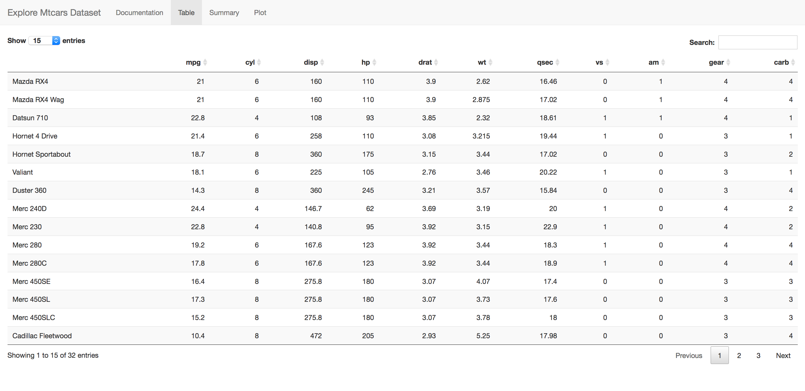
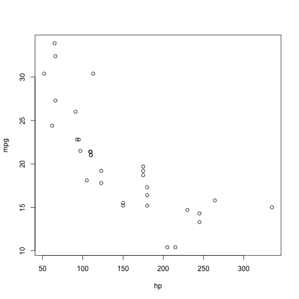

Explore Dataset
========================================================
author: Boukje Niemann 
date: oktober 19 2018
autosize: true
transition: concave
font-family: 'Verdana'

Explore Dataset App
========================================================

The explore dataset app gives you an idea what you can do
with the dataset mtcars
- Table the dataset 
- Get a summary of the dataset
- Plotting the relation between mpg and other variable

At the _same_ time the app gives you an idea what to do with 
***Shiny***

Table
========================================================

<small> 
The table tab shows a very flexible way of showing your 
data by presenting a few rows at a time.  
It uses _next_ buttons and you can sort your data by column
just clicking at the column header.  
Also you can search in the data to find a specific item.  
</small> 

This is all easily set up using the **datatable** function
from the **DT** package


Summary
========================================================
type: section
The summary tab shows the content of below function.

```r
summary(mtcars)
```

```
      mpg             cyl             disp             hp       
 Min.   :10.40   Min.   :4.000   Min.   : 71.1   Min.   : 52.0  
 1st Qu.:15.43   1st Qu.:4.000   1st Qu.:120.8   1st Qu.: 96.5  
 Median :19.20   Median :6.000   Median :196.3   Median :123.0  
 Mean   :20.09   Mean   :6.188   Mean   :230.7   Mean   :146.7  
 3rd Qu.:22.80   3rd Qu.:8.000   3rd Qu.:326.0   3rd Qu.:180.0  
 Max.   :33.90   Max.   :8.000   Max.   :472.0   Max.   :335.0  
      drat             wt             qsec             vs        
 Min.   :2.760   Min.   :1.513   Min.   :14.50   Min.   :0.0000  
 1st Qu.:3.080   1st Qu.:2.581   1st Qu.:16.89   1st Qu.:0.0000  
 Median :3.695   Median :3.325   Median :17.71   Median :0.0000  
 Mean   :3.597   Mean   :3.217   Mean   :17.85   Mean   :0.4375  
 3rd Qu.:3.920   3rd Qu.:3.610   3rd Qu.:18.90   3rd Qu.:1.0000  
 Max.   :4.930   Max.   :5.424   Max.   :22.90   Max.   :1.0000  
       am              gear            carb      
 Min.   :0.0000   Min.   :3.000   Min.   :1.000  
 1st Qu.:0.0000   1st Qu.:3.000   1st Qu.:2.000  
 Median :0.0000   Median :4.000   Median :2.000  
 Mean   :0.4062   Mean   :3.688   Mean   :2.812  
 3rd Qu.:1.0000   3rd Qu.:4.000   3rd Qu.:4.000  
 Max.   :1.0000   Max.   :5.000   Max.   :8.000  
```

Plot
========================================================
left: 70%

The app gives you:

- a choice box to change the 
variable in on the righthand side of the mpg ~ hp expression  
- a checkbox to give to add the linear regression line 
between the variables in the plot  
- the formula used to plot is shown in the header
- the correlation between the variables is shown in the header

***


```r
plot(mpg ~ hp, data = mtcars)
```


